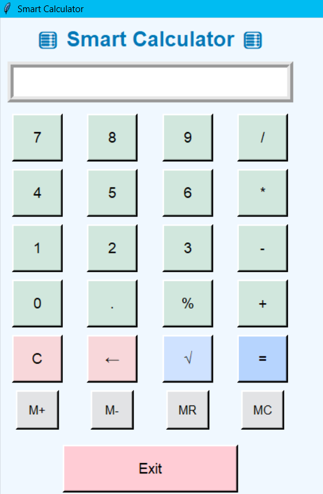

# CODSOFT-INTERNSHIP-Python-Programming-

🧮 Smart Calculator

A colorful and user-friendly Python Tkinter Calculator that performs basic and advanced math operations, with built-in memory features.

✨ Features

✅ Perform all basic operations — +, -, ×, ÷, %

✅ Square root function √

✅ Memory functions: M+, M-, MR, MC

✅ Clear (C) and backspace (←) buttons

✅ Colorful, modern, and responsive interface

✅ Error handling for invalid input

✅ Exit button to safely close the app

⚙️ How to Run

1️⃣ Make sure Python is installed on your system

2️⃣ Copy this code into a file named smart_calculator.py

3️⃣ Open Command Prompt or Terminal

4️⃣ Run the command:

python smart_calculator.py

5️⃣ Enjoy your calculator 🧮

🧠 Memory Button Use

Button	Function

M+	Adds current value to memory

M-	Subtracts current value from memory

MR	Recalls (shows) the stored memory value

MC	Clears the stored memory

💻 Built With
Python
Tkinter GUI
Math module

📸 Preview Idea
## 🖼 Output Screenshot

