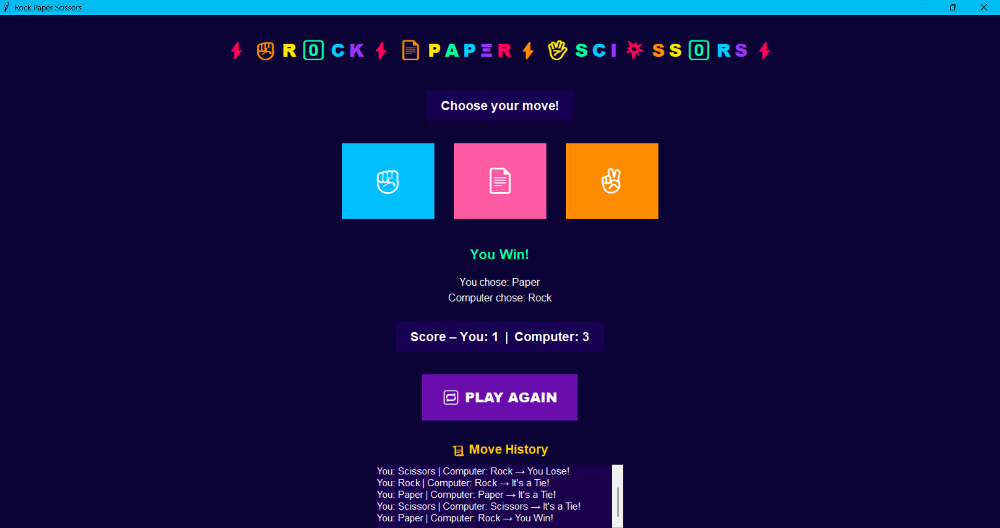

## ✊📄✌️ Rock–Paper–Scissors Game
CodSoft Python Programming Internship – Task 4

A fun and interactive Rock–Paper–Scissors Game built using Python (Tkinter GUI + Pygame sound effects).
The game allows the user to select Rock/Paper/Scissors, while the computer randomly chooses its move.
Results, score, move history, and sounds make the game more engaging and user-friendly.

## ⭐ Features

🎮 User-friendly GUI (Tkinter)

🤖 Computer generates random choice

🧠 Win/Lose/Tie logic

📊 Score tracking for both players

🔁 Play Again / Reset button

📜 Move history listbox

🎵 Sound effects: Win, Lose, Tie, Reset

🌈 Rainbow animated title

🎨 Colorful interface with emojis

## 🕹️ How to Play

Click on ✊ Rock, 📄 Paper, or ✌️ Scissors

Computer automatically picks one

Game shows:

Your choice

Computer’s choice

Winner result

Score updates automatically

Move history is added

Press 🔁 PLAY AGAIN to reset the game

🔢 Game Rules

✊ Rock beats Scissors

✂️ Scissors beat Paper

📄 Paper beats Rock

Same choice → 🟡 It's a Tie

## 🛠️ Technologies Used

Python

Tkinter – GUI

Pygame – Sound effects

Random – Computer move selection

## 📸 Screenshot

 ▶️ Run the Command

python rockpaper.py
