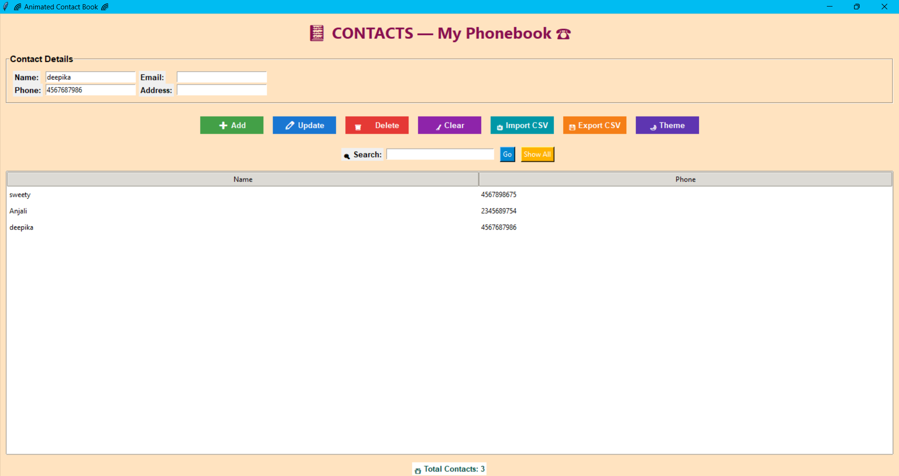

## 📔 Animated Contact Book — Tkinter GUI App

A beautiful, fully-featured contact management desktop application built using Python Tkinter, with animations, themes, gradients, CSV import/export & more!

## 📌 Features

➕ Add New Contacts

📖 View All Contacts

🔍 Search Contacts by Name or Number

✏️ Update Existing Contacts

❌ Delete Contacts

💾 Data saved permanently using file handling

## 🛠️ Tech Stack

🐍 Python 3.x

🎨 Tkinter GUI

📁 JSON for data storage

📄 CSV Import/Export

🔄 Animations using after()

🌈 Dynamic background transitions

           # Documentation
## ▶️ How to Run
Install Python 3

Save your script as contact.py

Run:

python contact.py

## 📥 Importing Contacts (CSV Format)

Your app reads from contacts.csv in the project folder.

Format must be:

Name	Phone	Email	Address

## 💾 Exporting Contacts

The app automatically exports your contact list into:

contacts.csv

## 🌙 Dark / Light Themes

Toggle between:

☀️ Light Mode

🌙 Dark Mode

With smooth UI color transitions.

## 🙌 Author

✨ Developed with ❤️ in Python & Tkinter

💡 Perfect mini-project for beginners & students

## 📸 Output Screenshot

## 🚀 Future Improvements

GUI with Tkinter

Search filters

Export contacts as CSV
